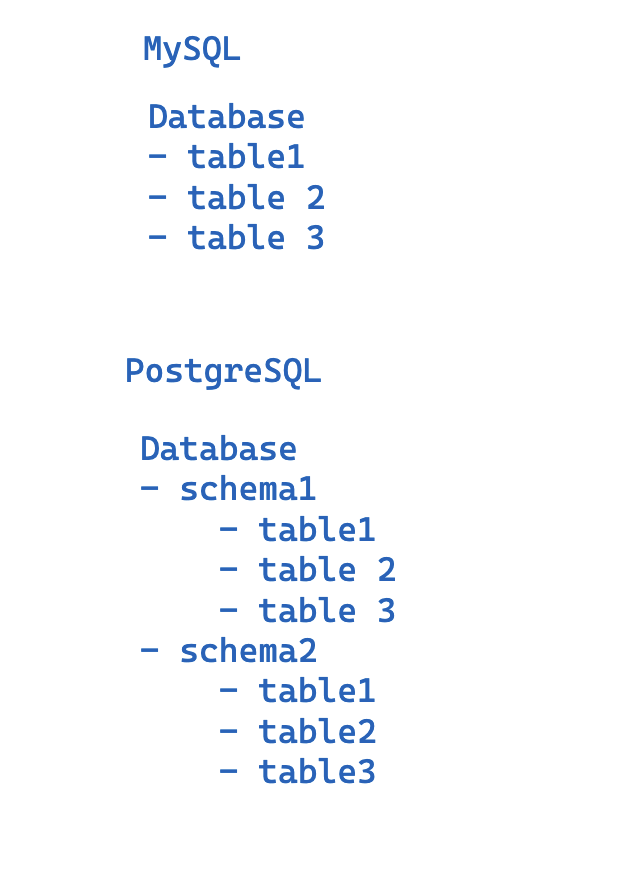

# Mastering PostgreSQL: Build Lightning-Fast, optimized, Scalable Databases

## 1. Introduction

## 2. Setup

- Install postgres
  - https://www.postgresql.org/download/
  - https://postgresapp.com/ (Recommended)
- PostgreSQL GUIs
  - https://tableplus.com/download
- psql cli: https://www.postgresql.org/docs/current/app-psql.html#:~:text=psql%20is%20a%20terminal%2Dbased,or%20from%20command%20line%20arguments.
  - terminal-based front-end to PostgreSQL

## 3. Postgres and Other Databases out there

- Other DBs
  - MySQL, SQLite
- Benefits of using Postgres
  - Extensibility
  - Performance
  - Powerful and feature rich
  - Community support
  - It is right tool for a lot of scenarios but not all
- We wil focus on Postgres ex: full text search
  - but in other scenarios such as real-time data, we might use other databases or elastic search etc.
- We will cover in depth some use cases where Postgres shines but also where it doesn't

## 4. psql cli

- we are going to use tableplus mainly but feel free to use psql cli
- make sure you have psql installed
  - `psql --version`
- connect to a database
  - `psql -d master_postgres_demo`
  - `psql -U kirandash -d master_postgres_demo`
- list databases
  - `\l`: this is the meta command
  - alternatively, you can run SQL command: `SELECT datname FROM pg_database;`
- create a database (not psql command, but SQL)
  - `CREATE DATABASE master_postgres_demo;`
- list tables
  - `\dt`
- help
  - `\?`
- quit
  - `\q`
- list users
  - `\du`
- describe 🔥
  - \d
  - describe table
    - `\d kirantest_example1`
- Expanded display 🔥
  - `\x auto`
  - to turn off: `\x`
- Note: psqlrc file
  - `~/.psqlrc`
  - `psqlrc` is a configuration file that allows you to set defaults for your psql session
  - https://wiki.postgresql.org/wiki/Psqlrc

## 5. What is a PostgreSQL schema?

- In other databases ex: MySQL or SQLite you have a database and tables

  - In Postgres, you have a database and schemas
  - A schema is a namespace that contains named database objects such as tables, views, indexes, data types, functions, and operators
  - Each database contains a `public` schema by default and can contain multiple schemas
  - each schema can contain multiple tables

    

- Comparison with SQLite:
  - You have a file and database
    - and each database has multiple tables
- Comparison with MySQL:
  - You have a MySQL server
    - and each server can have multiple databases
      - and each database can have multiple tables
- Postgres is a bit different
  - You have a Postgres server or Postgres cluster or Postgres process
    - and each server can have multiple databases
      - and each database can have multiple schemas
        - and each schema can have multiple tables

## 6. What is a Table Schema and Guidelines on defining it?

- Note that the PostgreSQL schema is different from the table schema
  - Table schema is the structure of the table
  - Schema in Postgres is a namespace that contains named database objects. So please understand the difference based on the context
- Table Schema Guidelines 🔥:
  - Make sure the schema is SMALL and not too big
  - Make sure the schema is SIMPLE
  - Make sure the schema is REPRESNTATIVE OF THE DATA to be stored 🔥 (Very Important)
    - Postgres has a wide range of data types. As a developer you need to choose the right data type for the right data
    - Why it is important?
      - this is not just to save the data space because space is cheap
      - but it is Mainly to make sure the bounds and indexes etc are correctly applied and postgres has a lot of utilities that might be helpful based on the data type
        - ex: postgres has uuid data type, jsonb data type, etc. so use them rather than using text or varchar
      - it will help with DX and also with indexing and performance etc.
