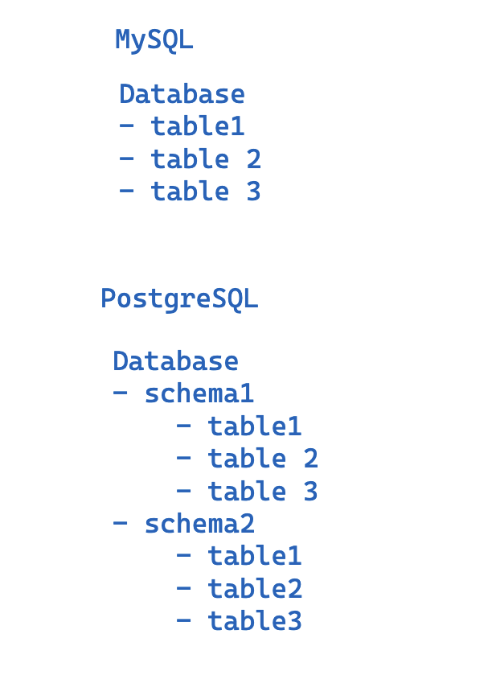
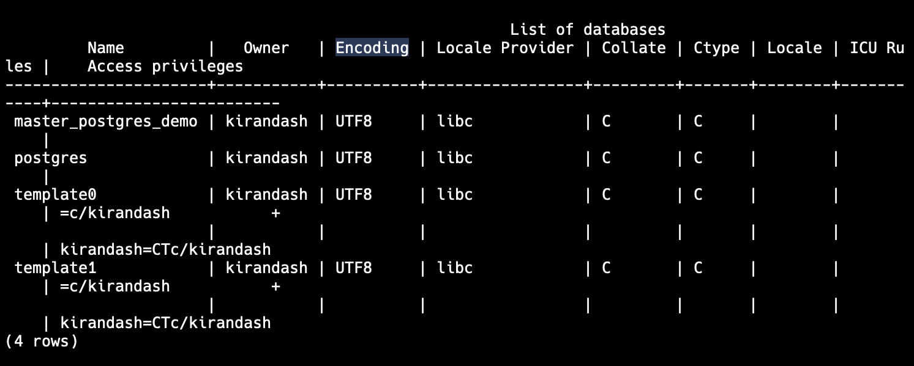

# Mastering PostgreSQL: Build Lightning-Fast, optimized, Scalable Databases

-- DAY 1 --

## 1. Introduction to PostgreSQL

### 1.1 Introduction

### 1.2 Setup

- Install postgres - we are using v17
  - https://www.postgresql.org/download/
    - Homebrew: https://formulae.brew.sh/formula/postgresql@17 or
    - postgress.app: https://postgresapp.com/
- PostgreSQL GUIs
  - https://tableplus.com/download
- psql cli: https://www.postgresql.org/docs/current/app-psql.html#:~:text=psql%20is%20a%20terminal%2Dbased,or%20from%20command%20line%20arguments.
  - terminal-based front-end to PostgreSQL
- DB version Management Tool
  - https://dbngin.com/

### 1.3 Postgres and Other Databases out there

- Other DBs
  - MySQL, SQLite
- Benefits of using Postgres
  - Extensibility
  - Performance
  - Powerful and feature rich
  - Community support
  - It is right tool for a lot of scenarios but not all
- We wil focus on Postgres ex: full text search
  - but in other scenarios such as real-time data, we might use other databases or elastic search etc.
- We will cover in depth some use cases where Postgres shines but also where it doesn't

### 1.4 psql cli

- we are going to use tableplus mainly but feel free to use psql cli
- make sure you have psql installed
  - `psql --version`
- connect to a database
  - `psql -d master_postgres_demo`
  - `psql -U kirandash -d master_postgres_demo`
- list databases
  - `\l`: this is the meta command
  - alternatively, you can run SQL command: `SELECT datname FROM pg_database;`
- create a database (not psql command, but SQL)
  - `CREATE DATABASE master_postgres_demo;`
- list tables
  - `\dt`
- help
  - `\?`
- quit
  - `\q`
- list users
  - `\du`
- describe 🔥
  - \d
  - describe table
    - `\d kirantest_example1`
- Expanded display 🔥
  - `\x auto`
  - to turn off: `\x`
- Note: psqlrc file
  - `~/.psqlrc`
  - `psqlrc` is a configuration file that allows you to set defaults for your psql session
  - https://wiki.postgresql.org/wiki/Psqlrc

### 1.5 What is a PostgreSQL schema?

- In other databases ex: MySQL or SQLite you have a database and tables

  - In Postgres, you have a database and schemas
  - A schema is a namespace that contains named database objects such as tables, views, indexes, data types, functions, and operators
  - Each database contains a `public` schema by default and can contain multiple schemas
  - each schema can contain multiple tables

    

- Comparison with SQLite:
  - You have a file and database
    - and each database has multiple tables
- Comparison with MySQL:
  - You have a MySQL server
    - and each server can have multiple databases
      - and each database can have multiple tables
- Postgres is a bit different
  - You have a Postgres server or Postgres cluster or Postgres process
    - and each server can have multiple databases
      - and each database can have multiple schemas
        - and each schema can have multiple tables

### 1.6 What is a Table Schema and Guidelines on defining it?

- Note that the PostgreSQL schema is different from the table schema
  - Table schema is the structure of the table
  - Schema in Postgres is a namespace that contains named database objects. So please understand the difference based on the context
- Table Schema Guidelines 🔥:
  - Make sure the schema is SMALL and not too big
  - Make sure the schema is SIMPLE
  - Make sure the schema is REPRESENTATIVE OF THE DATA to be stored 🔥 (Very Important)
    - Postgres has a wide range of data types. As a developer you need to choose the right data type for the right data
    - Why it is important?
      - this is not just to save the data space because space is cheap
      - but it is Mainly to make sure the bounds and indexes etc are correctly applied and postgres has a lot of utilities that might be helpful based on the data type
        - ex: postgres has uuid data type, jsonb data type, etc. so use them rather than using text or varchar
      - it will help with DX and also with indexing and performance etc.

### 1.8 TablePlus

- TablePlus is a modern, native tool with an elegant UI that allows you to simultaneously manage multiple databases such as MySQL, PostgreSQL, SQLite, Microsoft SQL Server, Redis, and more.
- I am going to use TablePlus in this course
- I will be using the free version of TablePlus

## 2. Understanding Data Types:

### 2.1 Integer Data Types

- Smallint or Int2

  - Storage: It uses 2 bytes of storage.
  - Range: -32768 to +32767 (-2^15 to 2^15 - 1)
  - Use case: It is used when you need to store small integers. Ex: Age does not need INTEGER OR BIGINT
  - In MySQL there is a concept of `UNSIGNED` or `SIGNED`. In Postgres, there is no such concept. So, you can store both positive and negative numbers or you can add a **check constraint** to make sure it is positive
  - It sets the COMPACT data type for the data but it does not set the bounds. So, you can store any number in it. If you want to set the bounds, you can use `CHECK` constraint

- Integer or Int4

  - Storage: It uses 4 bytes of storage.
  - Range: -2147483648 to +2147483647 (-2^31 to 2^31 - 1)
  - Use case: It is used when you need to store integers. Ex: zipCode

- Bigint or Int8

  - Storage: It uses 8 bytes of storage.
  - Range: -9223372036854775808 to +9223372036854775807 (-2^63 to 2^63 - 1)
  - Use case: It is used when you need to store large integers. Ex: phone number

### 2.2 Fractional Data Types - Numeric

- Integers are fast and efficient, but they are not suitable for storing fractional numbers because they are not precise
  - ex: weather temperature today is 25.5 but we don't want to store the decimal then we can use integer
- Floating point numbers are approximate and not precise
  - Floating points are faster than numeric but they are not precise
  - ex: currency prices, we need to be close but not exact
- Numeric data types:

  - used to store numbers with a fractional component
  - Numeric data types are precise and accurate but they are slower and use more storage than the integer data types and floating point data types
  - ex: research data, scientific data, financial data, etc.

- Numeric
  - https://neon.tech/postgresql/postgresql-tutorial/postgresql-numeric
  - The NUMERIC (or DECIMAL) data type in PostgreSQL is highly flexible and can represent a virtually unlimited range of values, constrained only by the maximum precision and scale allowed by PostgreSQL.
  - Range: -10^131072 to 10^131072
  - Storage: variable
  - argument: precision and scale
    - precision: total number of digits
    - scale: number of digits to the right of the decimal point
    - ex: `NUMERIC(5, 2)` means 5 digits in total and 2 digits to the right of the decimal point
      - ex: 123.45 or 12.34 will work but 1234.56 will not work because the total number of digits is 6 which is more than 5. another ex: 123.456 will not work because the number of digits to the right of the decimal point is 3 which is more than 2
    - scale is optional
      - ex: `NUMERIC(5)` means 5 digits in total and 0 digits to the right of the decimal point
    - scale can be negative
      - ex: `NUMERIC(5, -2)` means 5 digits in total and 2 digits to the left of the decimal point

-- DAY 2 --

### 2.3 Fractional Data Types - Floating Point (real, double precision)

- https://www.postgresql.org/docs/current/datatype-numeric.html
- supports fraction, not precise (approx) but fast
- use case:
  - weather, temperature, etc.
- Real:
  - Storage: 4 bytes (32 bits)
  - Precision: 6 decimal digits precision
  - ex: 123.456
  - alias: float4
  - Note: `FLOAT(p) Syntax` where if p is 1-24, then it is internally mapped to real i.e. 6 decimal digits precision
- double precision:
  - Storage: 8 bytes (64 bits)
  - Precision: 15 decimal digits precision
  - ex: 123.456789012345
  - alias: float8
  - Note: `FLOAT(p) Syntax` where if p is 25-53, then it is internally mapped to double precision i.e.e 15 decimal digits precision

### 2.4 Compare speed of different data types 🔥

### 2.5 Monetary Data Type - Money 🤑 (Not recommended)

- https://www.postgresql.org/docs/current/datatype-money.html
- DO NOT USE MONEY DATA TYPE 🚨
  - It is not precise as it is only precise to 2 decimal places
  - It is not recommended to use the money data type as it defaults to USD
- lc_monetary
  - The lc_monetary configuration parameter determines the currency symbol to be used by the to_char function when converting a money value to a string.
  - ex: `SET lc_monetary TO 'en_US.UTF-8';`
  - This only sets the currency symbol but does not automatically convert the number to the currency

### 2.6 Solutions to store money? (Recommended)

- store as integer (used by stripe and other similar companies)

  - fastest and most efficient but slightly less accurate
  - store as cents
  - ex: 100 cents = 1 dollar
  - ex: 10000 cents = 100 dollars

- store as numeric

  - precise and accurate
  - store as dollars
  - ex: 100.00 dollars

- store currency identifier in a new column along with the amount
  - ex: currency: USD, amount: 100.00

### 2.7 Infinity and NaN values for different data types (Rarely used)

- Theory:

  - numeric data type allows 'NaN' and 'Infinity' value but 'Infinity' will not be allowed if we set numeric bound ex: numeric(5,4)
  - integer does not allow 'NaN' or 'Infinity' value
  - real data type allows 'NaN' and 'Infinity' value
  - double precision data type allows 'NaN' and 'Infinity' value
  - Note: 'Inf' is also allowed as 'Infinity'
  - '-inf' is also allowed as '-Infinity'

- Use case for 'NaN' to be stored in the database:

  - ex: scientific data, research data, etc.
  - rarely used by me

- Use case for 'Infinity' to be stored in the database:
  - ex: in scenarios where you need to store a value that is greater than the maximum value that can be stored in the data type
  - ex if we are using real data type and if the value is greater than 3.4e38 then we can store it as 'Infinity'

### 2.8 Casting types in PostgreSQL using cast fn or cast operator(::), `pg_typeof`, `pg_column_size`

- https://neon.tech/postgresql/postgresql-tutorial/postgresql-cast
- cast is a function that converts a value of one data type to another
- use `cast` fn if you want portability or want to change to another database in the future
  - ex: `SELECT cast(98765 as money);`
- use `::` operator if you want to use the native syntax of Postgres
  - ex: `SELECT 98765::money;`
- `pg_typeof` is a function that returns the data type of the argument
- My recommendation is to use `::` operator as it is more readable and concise
- But if you are a developer who develops for multiple databases then you might want to use `cast` fn
- `pg_column_size` is a function that returns the size of the argument in bytes

### 2.9 Character Data Types - CHAR, VARCHAR, TEXT

- Three types of character data types in Postgres:
  - CHAR: Fixed length, padded with spaces
    - ex: `CHAR(5)`: 'abc '
    - DO NOT USE CHAR DATA TYPE 🚨
      - Drawbacks:
        - It is fixed length which means it will not allow you to store more than the specified length
        - it is padded with spaces. The padding is something that you might not want.
          - And it impacts a little bit on the storage because of the additional padded spaces.
          - And it also impacts a little bit on the performance because now developers will have to trim the spaces before using the data
          - Comparison of same text with different lengths might return false because of the padding
        - It is not efficient as it uses the same storage as VARCHAR and CHAR is not better than VARCHAR
      - How to store fixed length data?
        - Use VARCHAR and add a check constraint to make sure the length is fixed
  - VARCHAR (character varying): Variable length, no padding
    - ex: `VARCHAR(5)`: 'abc' or `VARCHAR`: 'abc'
    - VARCHAR without bounds is equivalent to TEXT
  - TEXT: Variable length, no padding
    - ex: `TEXT`: 'abc'
- Note that the underlying data structure is the same for all three data types

- If we save a large string in TEXT or VARCHAR without any constraint, postgres will use TOAST (The Oversized-Attribute Storage Technique) to store the large string
  - TOAST is a mechanism that allows PostgreSQL to store large values in a separate area of the disk and only store a reference to the large value in the table
  - TOAST is transparent to the user and is used to store large values in a more efficient way
- My Recommendation:
  - Don't use CHAR data type
  - Use VARCHAR without bounds or TEXT. I mostly use TEXT because it is more readable and concise
  - If you are using VARCHAR with bounds, make sure the bounds are representative of the data to be stored ex: for title of a blog post you can use VARCHAR(255) but for a blog post content you can use TEXT. or for username you can use VARCHAR(50) etc.

### 2.10 Check Constraint 🔥

- This is a constraint that allows you to specify a condition that must be met before data can be inserted or updated in a table
  - ex: `CHECK (age > 0)` or `CHECK (age BETWEEN 0 AND 100)` for age column which might be a SMALLINT data type which has a range of -32768 to +32767
  - ex: `CHECK (length(title) <= 255)` for title column which might be a VARCHAR(255) data type
- use `CONSTRAINT` keyword to define a check constraint
  - ex: `CONSTRAINT age_must_be_positive CHECK (age > 0)`
  - This will be helpful for other developers to understand the constraint and is good for logging and debugging
- Note that the check constraint can be applied to a column or a table
  - ex: `ALTER TABLE kirantest_example1 ADD CONSTRAINT age_must_be_positive CHECK (age > 0);`
- Use table constraint if you want to apply the constraint to multiple columns (Good Practice but not mandatory. You can also apply the constraint to multiple columns using column constraint but it is not a good practice)
  - ex: `CONSTRAINT fathers_age_must_be_gt_children_age CHECK (fathersAge > age)`
- Check Constraints are very powerful and can be used to enforce business rules, data integrity, etc.
  - Note that some developer might not like to put business logic in the database but it is a good practice to put some business logic in the database to enforce data integrity.
- My Recommendation:
  - Use check constraints to enforce data integrity and business rules
  - Make sure the check constraint is representative of the data to be stored
    - Ex: check constraint that define the data type bounds are good business rules to enforce
    - Ex: business logic such as trigger that sends an email when a user is created is not a good business rule to enforce using check constraint in the database layer. And you should put this logic in the application layer
  - Make sure the check constraint is simple and easy to understand

-- DAY 3 --

### 2.11 Domain Types 🔥

- https://www.postgresql.org/docs/current/domains.html
- A domain is a user-defined data type that is based on another underlying type. Optionally, it can have constraints that restrict its valid values to a subset of what the underlying type would allow. Otherwise it behaves like the underlying type — for example, any operator or function that can be applied to the underlying type will work on the domain type. The underlying type can be any built-in or user-defined base type, enum type, array type, composite type, range type, or another domain.
- Domain types can only be applied at column level and not at table level
  - while check constraints can be applied at column level or table level
- Note that domain types and check constraints can be modified. When you do, it will only be applied to the new data that is inserted or updated. The existing data will not be validated against the new domain type or check constraint
- Recommendation:
  - Use domain type over check constraint for column level constraints
    - because domain type is more readable and concise and reusable
  - Use check constraint for table level constraints

### 2.12 Charset/Encoding and collation

- `\l` to list databases and their encoding and Collate
  
- Encoding: The character set encoding used in the database
  - ex: UTF8, LATIN1, etc.
  - UTF8 is the most common encoding used as it supports a wide range of characters, emojis etc and is the default encoding in Postgres
  - If data is not legal and not valid in the encoding then it will be stored as `?`
- Collation: Collation defines a set of rules for comparing characters in a character set
  - ex: en_US.UTF-8, en_IN.UTF-8, C etc.
  - en_US.UTF-8 is the most common collation used as it is the default collation in Postgres
  - Collation is used to sort and compare strings
  - If you want to sort strings in a different language, you can use a different collation
- Note that some of us might have C collation by default which is language-independent and is faster than other collations
- Recommendation:
  - Use UTF8 encoding and en_US.UTF-8 collation as it is the most common and widely used encoding and collation
  - If you are building a multi-language application, you might want to use a different encoding and collation
- There is also a client encoding which is the character set encoding used by the client application. If the client encoding is different from the database encoding, then client will convert the data to the client encoding before sending it to the database and vice versa

  - to show the client encoding: `SHOW client_encoding;`
  - ex: `SET client_encoding TO 'UTF8';`
  - Recommendation: do not change the client encoding unless you have a good reason to do so because some data might be lost if the client encoding is changed

- Ex of collation: `SELECT 'sourav' = 'SOURAV' COLLATE "en_US.UTF-8" AS result;`
- We can create a custom collation that is case-insensitive. But note that we have better ways to do this without using Custom collation
- Recommendation:
  - Ideally I won't use custom collation because it is not needed in most cases 🚨
  - ex: for case insensitive search,
    - you can do it on client side
    - or you can use `ILIKE` operator in Postgres. This is good but not index assisted
    - you can create another column that stores the lowercase of the column and then you can search on that column.
    - in future we will see generated columns and functional indexes which will help in this scenario ✅
- Note that you also set custom collation for a specific column or a specific index

### 2.13 Binary Data types - BYTEA

- Varying size column
- can store up to 1 GB of data
- when data is large postgres will use TOAST to store the data
- Recommendation:

  - Use BYTEA data type to store binary data. Or to save text data as binary data
  - If you need to store files use a file storage system like S3, or otther S3 compatible service like R2, GCS, etc. and then use a CDN. Some managed databases like RDS, Xata etc store BYTEA data till 5 GB and then automatically move the data to S3. DO NOT USE BYTEA data type to store files in the database 🚨
    - https://xata.io/
    - https://aws.amazon.com/rds/
    - If you do it on your own then if the file is deleted from the file storage system then the data in the database will be useless and we will have to handle the cleanup of the data in the database or the sync. But if you use a managed database then the managed database will take care of the cleanup and sync
  - If file size is small then you can store it in the database but make sure you have a good reason to do so (Not recommended)

- `SHOW bytea_output;` to show the bytea output - hex or escape, hex is the default. RECOMMENDED
- `SET bytea_output TO 'escape';` to set the bytea output to escape - this is useful when you want to see the binary data in a more readable format but NOT RECOMMENDED as this might loose some data

### 2.14 md5 hash function, sha256 hash function

- md5: `SELECT md5('hello');` to get the md5 hash of the string
  - DO NOT USE MD5 TO STORE SECURE DATA 🚨
  - Super fast but not secure
  - Use it when you want to compress large data and compare it with another data to do strict equality check. Use it with uuid so that the column size is the smallest ex: `SELECT md5('Kiran Kumar Dash')::uuid;`
  - Using md5 might cause security audit failure
  - use sha256 or bcrypt for secure data

### 2.15 UUID data type

- A UUID is written as a sequence of lower-case hexadecimal digits, in several groups separated by hyphens, specifically a group of 8 digits followed by three groups of 4 digits followed by a group of 12 digits, for a total of 32 digits representing the 128 bits. An example of a UUID in this standard form is: `a0eebc99-9c0b-4ef8-bb6d-6bb9bd380a11`
- https://www.postgresql.org/docs/current/datatype-uuid.html
- UUID as data type
- UUID as primary key (to cover later)
- UUID is much more compact and is faster to operate
  - store uuids as UUID (16 bytes) than as text (40 bytes approx)
- postgres can generate uuid `gen_random_uuid()`
  - 🚨 This is not good for using as a primary key because it is not sequential and it is not good for indexing
  - There are other ways to generate uuids that are sequential and are good for indexing
    - uuidv1 till uuidv7
    - For uuidv7: the first 8 bytes are the timestamp and the last 8 bytes are the random bytes
      - ✅ Recommended: uuidv7 is not yet implemented in Postgres by default. But you can add extension to use it. Also you might find it on managed databases like RDS, Xata etc.
- Recommended:
  - Use UUID data type to store UUIDs because it's more compact and faster to operate
  - Do not use TEXT data type to store UUIDs
